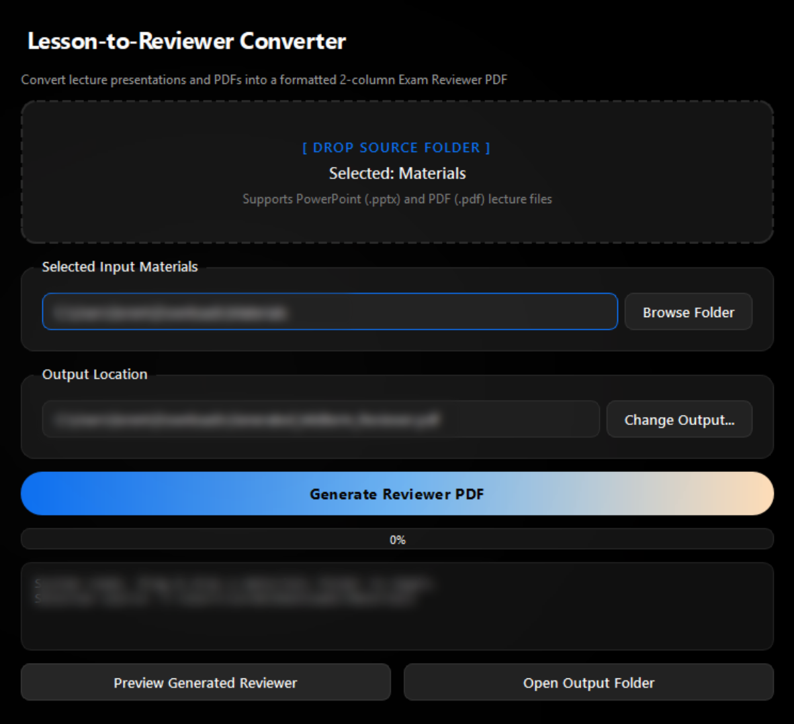

# Lesson-to-Reviewer Converter

A modern **PySide6 (Qt 6)** Desktop Application & Standalone Executable that converts lecture presentation folders (`.pptx` and `.pdf`) into formatted **2-column Exam Reviewer PDFs**.



## Quick Start

### Option 1: PowerShell One-Liner Installer (Recommended)
Run this command in PowerShell to automatically install and launch the desktop app:

```powershell
iwr -useb https://raw.githubusercontent.com/rem-ctrl/LessonToReviewerConverter/main/install.ps1 | iex
```

### Option 2: Run Standalone Executable
Double-click `dist/LessonToReviewerConverter.exe` or download it directly from [Releases](https://github.com/rem-ctrl/LessonToReviewerConverter/releases).

### Option 3: Run via Python
1. Install dependencies:
```bash
pip install PySide6 python-pptx pypdf reportlab
```
2. Run the application:
```bash
python app.py
```

## Features
- **Drag & Drop Box**: Drop any folder containing PowerPoint (`.pptx`) or PDF (`.pdf`) lecture materials directly into the app window.
- **Multi-Threaded Conversion Engine**: Runs file extraction and ReportLab PDF building on a background worker thread (`QThread`).
- **Automated Highlighting & Comparative Matrices**: Wraps key terms/names/dates in yellow highlights, exam traps in red warnings, and builds side-by-side comparative matrices.
- **Active Recall Quizzes**: Generates self-test practice questions for every topic.
- **Standalone Windows Executable (`.exe`)**: Portable binary without requiring Python.

## Project Structure
```text
LessonToReviewerConverter/
├── app.py                 # Main GUI Application Entry Point
├── ui_components.py       # PySide6 Widgets & Drag-and-Drop Dropzone
├── converter_engine.py    # Text Extraction & ReportLab PDF Generator
├── styles.qss             # QSS Dark Theme Stylesheet
├── install.ps1            # PowerShell One-Liner Installer
└── dist/
    └── LessonToReviewerConverter.exe  # Portable Executable
```
